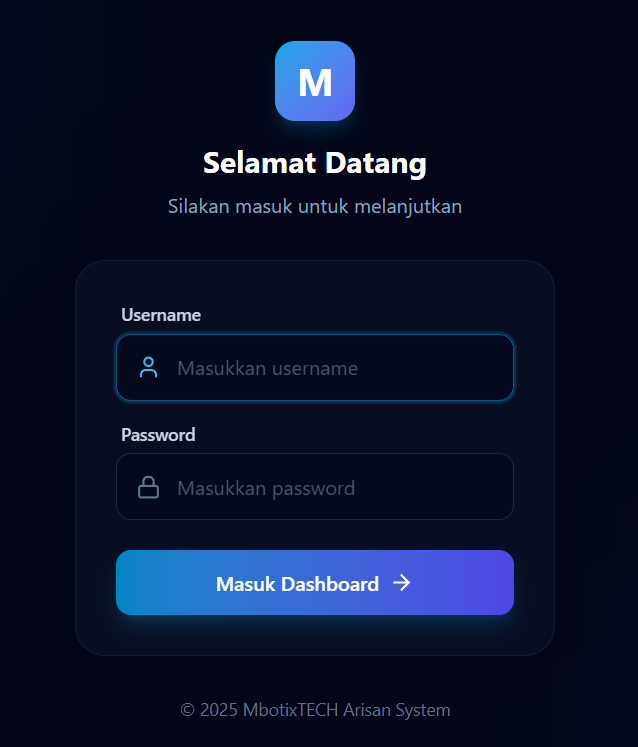
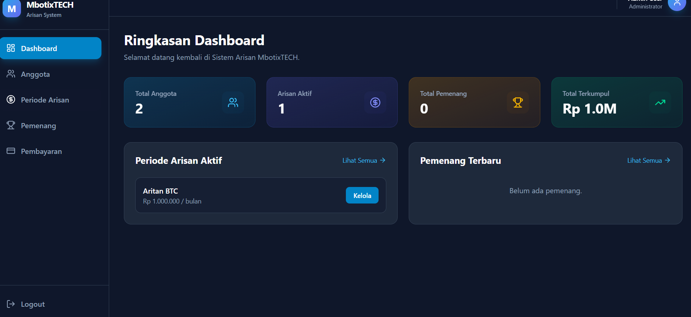
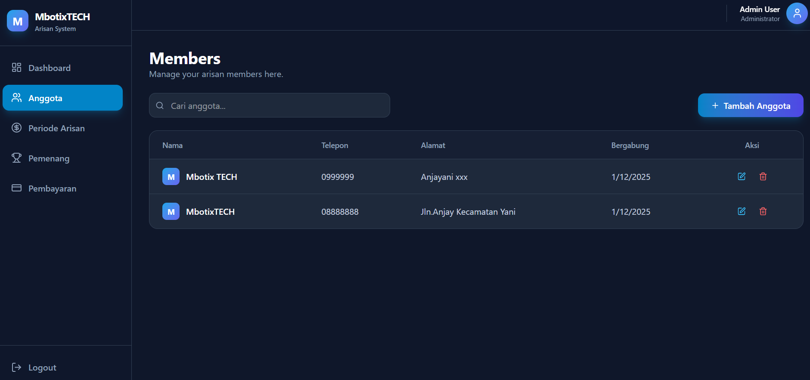
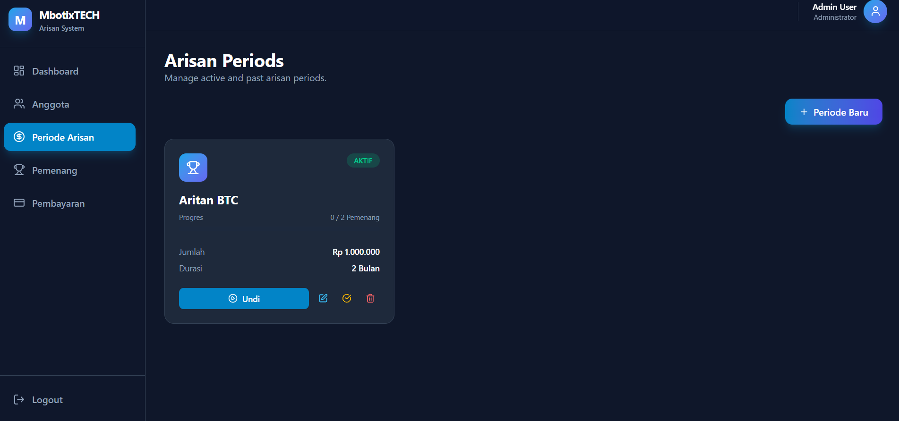
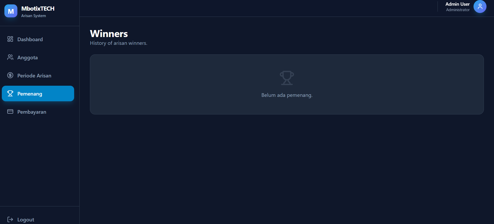
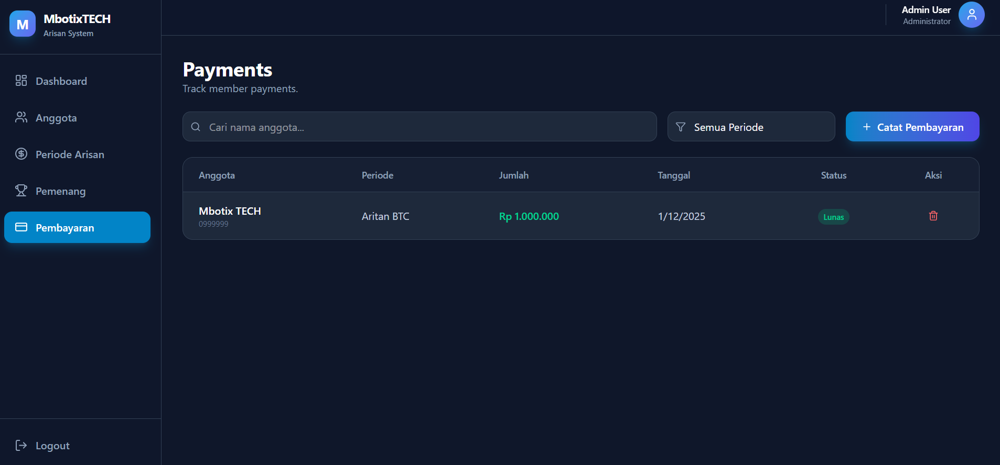

# Sistem Arisan MbotixTECH

Sistem manajemen arisan modern yang dibangun dengan Next.js, Prisma, dan Tailwind CSS. Aplikasi ini dirancang untuk memudahkan pengelolaan anggota, periode arisan, pemenang, dan pembayaran dengan antarmuka yang indah dan responsif.

## 📸 Screenshots

<table>
  <tr>
    <td></td>
    <td></td>
  </tr>
  <tr>
    <td></td>
    <td></td>
  </tr>
  <tr>
    <td></td>
    <td></td>
  </tr>
</table>

## Fitur Utama

-   **Dashboard Interaktif**: Ringkasan statistik anggota, arisan aktif, pemenang, dan total dana terkumpul.
-   **Manajemen Anggota**: Tambah, edit, dan hapus data anggota.
-   **Periode Arisan**: Kelola periode arisan, termasuk jumlah setoran dan durasi.
-   **Pengundian Pemenang**: Sistem pengundian acak yang adil untuk menentukan pemenang arisan.
-   **Pencatatan Pembayaran**: Lacak pembayaran anggota untuk setiap periode.
-   **Keamanan**: Sistem login aman dengan sesi terenkripsi.
-   **Desain Responsif**: Tampilan yang optimal di desktop dan perangkat mobile.

## Persyaratan Sistem

-   Node.js (versi 18 atau lebih baru)
-   npm (Node Package Manager)
-   Database yang didukung oleh Prisma (SQLite default untuk pengembangan)

## Cara Instalasi

1.  **Clone repositori ini:**

    ```bash
    git clone https://github.com/MbotixTech/arisan-online.git
    cd arisan-online
    ```

2.  **Instal dependensi:**

    ```bash
    npm install
    ```

3.  **Konfigurasi Environment Variables:**

    Salin file `.env.example` menjadi `.env` (jika belum ada) dan sesuaikan isinya:

    ```bash
    cp .env.example .env
    ```

    Isi file `.env` dengan konfigurasi berikut:

    ```env
    # Koneksi Database (Default: SQLite)
    DATABASE_URL="file:./dev.db"

    # Kredensial Admin untuk Login
    ADMIN_USERNAME=admin
    ADMIN_PASSWORD=admin

    # Kunci Rahasia untuk Enkripsi Sesi (Ganti dengan string acak yang panjang)
    SESSION_SECRET=rahasia_super_aman_ganti_ini
    ```

4.  **Setup Database:**

    Jalankan migrasi Prisma untuk membuat tabel database:

    ```bash
    npx prisma migrate dev --name init
    ```

5.  **Jalankan Aplikasi:**

    Mode pengembangan:

    ```bash
    npm run dev
    ```

    Akses aplikasi di `http://localhost:3000`.

    Mode produksi:

    ```bash
    npm run build
    npm start
    ```

## Penggunaan

1.  **Login**: Buka aplikasi dan masuk menggunakan `ADMIN_USERNAME` dan `ADMIN_PASSWORD` yang telah Anda atur di file `.env`.
2.  **Dashboard**: Halaman utama menampilkan ringkasan status arisan saat ini.
3.  **Anggota**: Buka menu "Anggota" untuk menambahkan peserta arisan baru.
4.  **Periode Arisan**: Buat periode arisan baru di menu "Periode Arisan". Tentukan nama, jumlah iuran, dan durasi.
5.  **Pembayaran**: Catat pembayaran anggota di menu "Pembayaran".
6.  **Pemenang**: Lakukan pengundian pemenang di menu "Periode Arisan" dengan menekan tombol "Undi" (Play). Lihat riwayat pemenang di menu "Pemenang".

## 📄 License

This project is licensed under the MIT License - see the [LICENSE](LICENSE) file for details.
